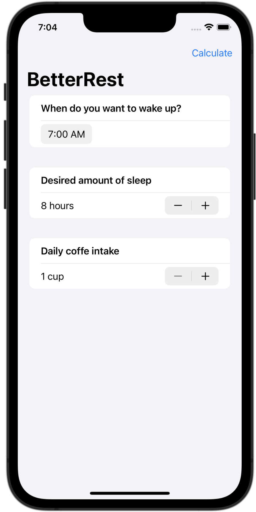
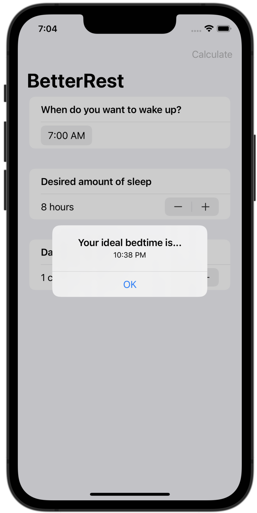

# Better-Rest
SwiftUI and Core ML (machine learning (ML)) implemented in the app. 

BetterRest app designed to help coffee drinkers get a good night's sleep by asking them three questions:
1. When do they want to wake up?
2. Roughly how many hours of sleep do they want?
3. How many cups of coffee do they drink per day?

After that the computer will make predictions and inform user about the ideal bedtime.
This is possible with the power feature of IOS development - machine learning.

  

Based on 100 Days with SwiftUI by Paul Hudson
